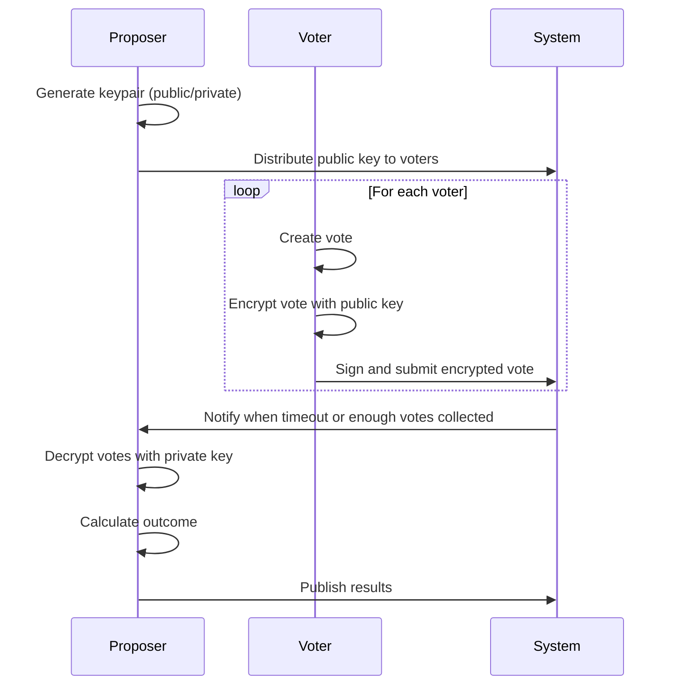
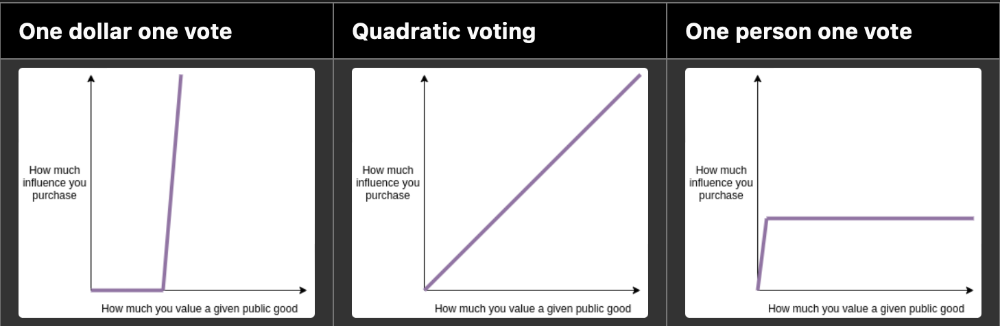
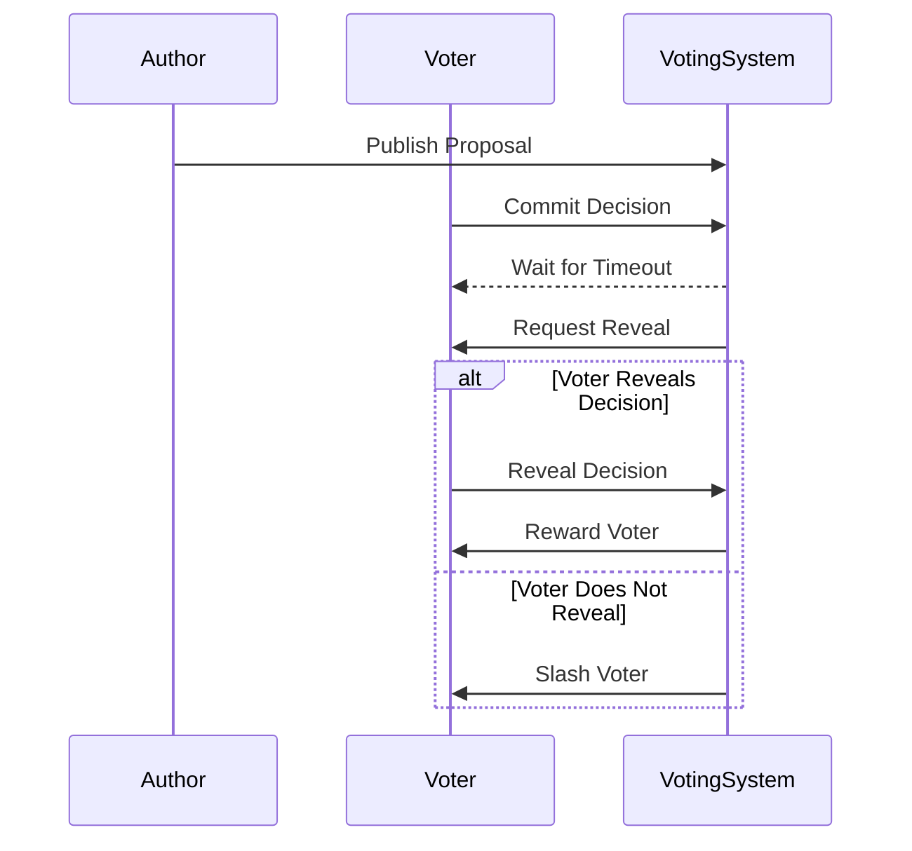

# Harvest Moon

A community-based platform agnostic fact-checking system

A pallet implementing quadratic voting based on substrate collective pallet. Some additional features has been done such as the slashing mechanism which provides an incentive for voters to collaborate in the decision making process and the commit-reveal voting system to prevent inside-trading.

<!-- Heads up to [pallet/voting](https://github.com/falcucci/harvest-moon/blob/main/pallets/voting) to see [tests](https://github.com/falcucci/harvest-moon/blob/main/pallets/voting/src/tests.rs) and implementation. -->

**NOTE**: _This is an experimental project, no research has been conducted to actually prove economic costs of this governance system._

A community-based platform agnostic fact-checking collactor to verify the veracity[^1] of posts, comments or any user-based interaction calculating its outcomes rating which must be public.

Multiple notes could be shown as a suggesting note or as a reminder that the goal is not to correct every piece of information; rather, it serves to remind individuals of the existence of multiple perspectives, that certain kinds of posts that look convincing and engaging in isolation are actually quite incorrect.

<em>The following note may be helpful; however,

it is often possible to verify such inaccuracies through a simple internet search.</em>

|   Rating Type    | Weighted Votes | Percentage |
| :--------------: | :------------: | :--------: |
|     Helpful      |      450       |   56,3%    |
|   Not Helpful    |      280       |   35,0%    |
| Somewhat Helpful |       70       |    8,8%    |

For community-based fact-checking systems to achieve their intended purpose of enhancing information accuracy, they must be designed with mechanisms that ensure a balanced representation of diverse and genuine point of view, which is something that the [Quadratic Voting](https://papers.ssrn.com/sol3/papers.cfm?abstract_id=2003531) system can help to achieve.

The most popular Community Notes feature exemplifies the challenges faced when implementing community-based fact-checking systems. In communities predominantly leaning towards a specific political ideology, the system may fail to deliver unbiased fact-checking.

At the moment, [those](https://github.com/twitter/communitynotes/blob/main/documentation/about/challenges.md?plain=1#L20) platforms mirror exactly the same problem that they are trying to solve, by not having a trully diverse group of people in a general[^2] public to score and fact-check the information.

This idea explores an innovative approach to decision-making by integrating quadratic voting with anonymity and a slash-reward mechanism for voters.

### The very first approach

The initial approach implements a secure and effective voting system, we start with the proposer generating a keypair, consisting of a public and private key. The public key is then shared with all voters and setting the stage for a secure voting process.

### The second

As the first approach may seem more convenient for the voter since they only need to submit a single transaction to represent a vote, it harm the global integrity of a governance protocol. The voter can simply inside-trade the actual votes and give away votes of other voters before the end of voting phase. The commit and reveal approach ensures trustlessness of a solution, hence, a suitable solution.

    
    <em>These models highlight varying approaches to balancing influence and equity in decision-making.</em>

---

In quadratic voting, you could eschew single-issue voting because you can trade influence on whats less important to you for influence on whats more important.

So, while it may seem a burden for user and proposer, the economic incentive actually motivates any voter to end the commit phase and reveal phase ASAP to potentially collect reward from voting.

---

**commit-reveal**: voting takes place in 2 separate chronologic time periods. this prevents the voting process itself from influencing vote results

- **commit stage**: time period where a user can submit a secret token-weighted vote, locking those tokens. committed votes are concealed using a [**salted hash**](https://en.wikipedia.org/wiki/Salt_%28cryptography%29) of the user's vote option and a random number;
- **reveal stage**: time period where a user can unlock their secret vote, confirming the vote's token-weight and option;

[^1]: In communities where the majority of members share a similar political leaning, the Community Notes feature can function in the sense as a tool to highlight strong disagreements, such as debates over leader's status or whether certain policies align with fiscal conservative values. This could result in a spectrum of beliefs and potentially lead to "corrections" that bring you closer to the truth. However, this process might often resemble finding a middle ground between empirical evidence and unfounded claims, which doesn't necessarily lead to factual accuracy. Instead, it might simply label dissenting views as socially unacceptable, rather than providing genuine fact-checking ratings.
[^2]: The issue is that without the general public or at least proportional representation of all its demographics, you don't necessarily get closer to the truth; you simply approach community ideological consensus. This utility is most effective at consolidating viewpoints into those widely accepted by the majority, with any movement toward truth being more of a side effect.
