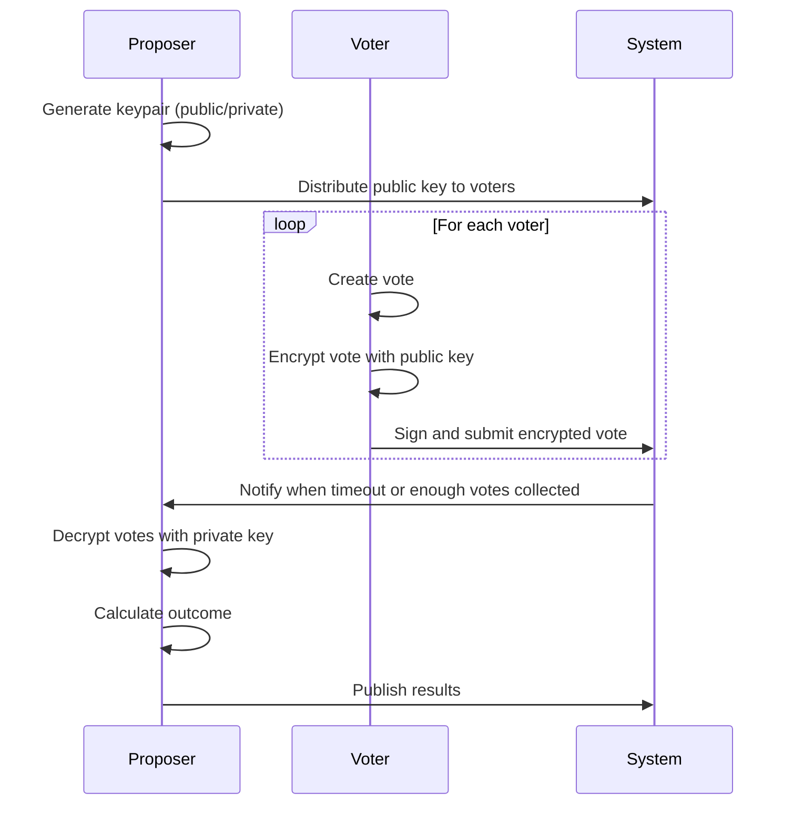

A community-based platform agnostic fact-checking system

**NOTE**: _This is an experimental project, no research has been conducted to actually prove economic costs of this governance system._

A community-based platform agnostic fact-checking collactor to verify the veracity[^1] of posts, comments or any user-based interaction calculating its outcomes rating which must be public.

Multiple notes could be shown as a suggesting note or as a reminder that the goal is not to correct every piece of information; rather, it serves to remind individuals of the existence of multiple perspectives, that certain kinds of posts that look convincing and engaging in isolation are actually quite incorrect.

<em>The following note may be helpful; however,

it is often possible to verify such inaccuracies through a simple internet search.</em>

|   Rating Type    | Number of Responses | Percentage |
| :--------------: | :-----------------: | :--------: |
|     Helpful      |         214         |   62,8%    |
|   Not Helpful    |         116         |   34,0%    |
| Somewhat Helpful |         11          |    3,2%    |

For community-based fact-checking systems to achieve their intended purpose of enhancing information accuracy, they must be designed with mechanisms that ensure a balanced representation of diverse and genuine point of view, which is something that the Quadratic Voting system can help to achieve adding a pos training model to

The most popular Community Notes feature exemplifies the challenges faced when implementing community-based fact-checking systems. In communities predominantly leaning towards a specific political ideology, the system may fail to deliver unbiased fact-checking.

At the moment, [those](https://github.com/twitter/communitynotes/blob/main/documentation/about/challenges.md?plain=1#L20) platforms mirror exactly the same problem that they are trying to solve, by not having a trully diverse group of people in a general[^2] public to score and fact-check the information.

[^1]: If your community is made up of people who either lean forward one direction (or most of them) politically, then your Community Notes feature could still "work" in the sense that it could highlight strong disagreements, such as debates over leader's status or whether certain policies align with fiscal conservative values. This could result in a spectrum of beliefs and potentially lead to "corrections" that bring you closer to the truth. However, this process might often resemble finding a middle ground between empirical evidence and unfounded claims, which doesn't necessarily lead to factual accuracy. Instead, it might simply label dissenting views as socially unacceptable, rather than providing genuine fact-checking ratings.
[^2]: The issue is that without the general public or at least proportional representation of all its demographics, you don't necessarily get closer to the truth; you simply approach community ideological consensus. This utility is most effective at consolidating viewpoints into those widely accepted by the majority, with any movement toward truth being more of a side effect.
